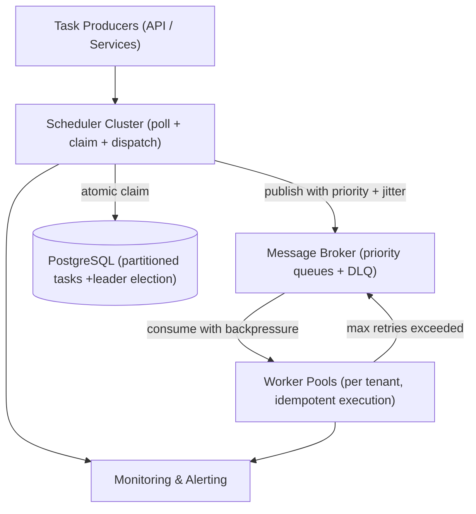

# Distributed Task Scheduler

### Goal

A scalable, durable, exactly-once task scheduler that decouples timing from execution for billions of heterogeneous background jobs. Built as a shared, multi-tenant service with operational maturity for production environments.

### Non-goals

* Not a workflow orchestration engine (no DAGs, dependencies, or chaining of tasks)
* Not an execution environment—business logic lives in separate domain services, not in the scheduler
* Not targeting sub-second scheduling precision; low drift (seconds) is acceptable
* No single-tenant, in-process, or embedded scheduling; designed as a shared service

### Numbers

* **QPS:** Up to 10,000 tasks dispatched per second at peak
* **Storage:** \~1 TB/year for billions of tasks (≈1 KB per task metadata record)
* **Latency target:** 99.9% of tasks enqueued within 5 seconds of `scheduled_time`; exactly-once execution guarantee
* **Scheduler nodes:** Horizontally scaled to N instances; no single coordinator bottleneck
* **Tenants:** Multi-tenant with isolation guarantees per tenant

### Architecture Diagram



### Database Schema

```sql
CREATE TABLE tasks (
    id              UUID PRIMARY KEY DEFAULT gen_random_uuid(),
    task_type       VARCHAR(255) NOT NULL,
    tenant_id       VARCHAR(64) NOT NULL,          -- Multi-tenant isolation
    payload         JSONB NOT NULL,
    status          VARCHAR(20) NOT NULL DEFAULT 'PENDING',
    -- PENDING, IN_PROGRESS, COMPLETED, FAILED, DEAD_LETTERED
    priority        INT NOT NULL DEFAULT 0,         -- Higher = more urgent
    scheduled_at    TIMESTAMP NOT NULL,
    max_retries     INT NOT NULL DEFAULT 3,
    retry_count     INT NOT NULL DEFAULT 0,
    version         BIGINT NOT NULL DEFAULT 0,      -- Optimistic lock
    claimed_by      VARCHAR(255),                   -- Which scheduler claimed it
    claimed_at      TIMESTAMP,
    started_at      TIMESTAMP,
    completed_at    TIMESTAMP,
    error_message   TEXT,
    partition_key   INT NOT NULL,                   -- Hash-based partitioning (0..N-1)
    created_at      TIMESTAMP NOT NULL DEFAULT NOW(),
    updated_at      TIMESTAMP NOT NULL DEFAULT NOW()
) PARTITION BY RANGE (scheduled_at);

-- Partitions created per month (auto-managed by pg_partman)
CREATE TABLE tasks_2026_01 PARTITION OF tasks
    FOR VALUES FROM ('2026-01-01') TO ('2026-02-01');
-- ... pg_partman auto-creates partitions ahead of time

-- Composite index for efficient polling
CREATE INDEX idx_tasks_poll ON tasks (status, scheduled_at, priority DESC)
    WHERE status = 'PENDING';

-- Index for partition-based polling
CREATE INDEX idx_tasks_partition ON tasks (partition_key, status, scheduled_at)
    WHERE status = 'PENDING';

-- Deduplication table for worker idempotency
CREATE TABLE processed_tasks (
    task_id     UUID PRIMARY KEY,
    worker_id   VARCHAR(255),
    processed_at TIMESTAMP DEFAULT NOW(),
    TTL         TIMESTAMP DEFAULT NOW() + INTERVAL '30 days'
);

-- Leader election table for singleton operations
CREATE TABLE leader_election (
    role        VARCHAR(100) PRIMARY KEY,  -- e.g., 'cleanup_leader'
    instance_id VARCHAR(255) NOT NULL,
    acquired_at TIMESTAMP NOT NULL DEFAULT NOW(),
    expires_at  TIMESTAMP NOT NULL
);
```

#### Versioning & Optimistic Locking

Every task row includes a `version` column (BIGINT, starts at 0). All claim operations use:

```sql
UPDATE tasks
SET status = 'IN_PROGRESS', version = version + 1, claimed_by = ?, claimed_at = NOW()
WHERE id = ? AND version = ? AND status = 'PENDING';
```

If the `version` changed between read and update (another scheduler claimed it), zero rows are affected—the update is a no-op, and the scheduler moves on. This is defense-in-depth alongside `FOR UPDATE SKIP LOCKED`.

#### Advisory Locks (Alternative / Complementary)

For operations that don't require row locking (e.g., leader election), PostgreSQL advisory locks provide lightweight, session-scoped locking:

```sql
SELECT pg_try_advisory_lock(hashtext('cleanup_leader'));
```

The cleanup singleton uses advisory locks to ensure only one node runs the visibility timeout scan at any time. If the lock holder crashes, the lock is released automatically when the connection drops.

***

\
Poll and Claim Loop

**The flow (no code):**

1. Scheduler queries for `PENDING` tasks where `scheduled_at <= now()`, ordered by `priority DESC, scheduled_at ASC`, limited to a batch size (e.g., 50 rows).
2. The query uses `FOR UPDATE SKIP LOCKED` to:
   * Lock the selected rows in this transaction
   * Skip rows already locked by another scheduler's concurrent query
   * Return immediately without blocking
3. For each returned row, the scheduler attempts the atomic `UPDATE... WHERE version = ?` claim.
4. If the update returns a row (claim succeeded), publish the task to the broker with its priority.
5. If the update returns zero rows (another scheduler got it), skip and continue to the next task.
6. If no tasks are returned, back off with exponential delay (with jitter) before polling again.
7. The broker dispatch adds a random 1–5 second jitter to smooth thundering herds.

***

### Coordination Using Queues (Redis / ZooKeeper / Other)

For environments where sub-millisecond claim latency is required or where the database is not the coordination point:

**Redis-based coordination:**

* On task creation, push the `task_id` and its `scheduled_at` score into a Redis Sorted Set (`ZADD tasks:pending <timestamp> <task_id>`).
* Scheduler nodes call `ZPOPMIN tasks:pending` (atomic pop of the earliest ready task). Redis 5.0+ supports this natively.
* If `ZPOPMIN` returns a task\_id, the scheduler claims it. No other scheduler saw this task\_id.
* **Tradeoff:** Redis must be configured with AOF persistence (`appendfsync everysec`) and replicas to avoid data loss on crash. If Redis loses data, orphaned tasks in PostgreSQL are recovered by the visibility timeout cleanup.

**ZooKeeper-based coordination:**

* Tasks are ephemeral sequential znodes under `/tasks/pending/`. Schedulers watch the children. The scheduler with the lowest sequence number claims the task.
* ZooKeeper's strong consistency guarantees make this suitable for leader election and task claiming without database locks.
* **Tradeoff:** ZooKeeper adds operational complexity (ensemble management, session timeouts). It's justified when you need CP (consistent) coordination without relying on the database.

**Choosing the right mechanism:**

| Mechanism                           | When to Use                                                  | Avoid When                                        |
| ----------------------------------- | ------------------------------------------------------------ | ------------------------------------------------- |
| PostgreSQL `FOR UPDATE SKIP LOCKED` | Default. Works for 95% of cases. No extra infrastructure     | You have extreme lock contention across 50+ nodes |
| Redis Sorted Sets                   | You need sub-ms claim latency and already run Redis          | You can't tolerate Redis data loss risk           |
| ZooKeeper                           | You need strong consistency for coordination without DB load | You don't want to operate a ZooKeeper ensemble    |

***

### Priority Queues & Task Starvation Prevention

Tasks are published to the broker with a `priority` header. The broker routes to separate queues (high/medium/low). Without fairness mechanisms, a flood of high-priority tasks starves low-priority tasks indefinitely.

**Prevention mechanisms:**

| Mechanism                              | How It Works                                                                                                                                                                                                             |
| -------------------------------------- | ------------------------------------------------------------------------------------------------------------------------------------------------------------------------------------------------------------------------ |
| **Weighted fair queuing**              | Each priority queue gets a minimum share of worker capacity. Even if high-priority queue is overflowing, 10% of workers are reserved for low-priority.                                                                   |
| **Aging**                              | Task priority increases the longer it waits. A marketing email queued for 24 hours gets promoted to medium priority automatically. The scheduler's poll query sorts by effective priority (`base_priority + age_bonus`). |
| **Separate worker pools per priority** | Dedicated workers for low-priority tasks. These workers never process high-priority tasks. Low-priority tasks always make progress, just slower.                                                                         |
| **Priority inversion detection**       | Monitor the maximum wait time per priority level. If low-priority tasks are waiting longer than 5 minutes, alert and investigate.                                                                                        |

***

### Visibility Timeout & Cleanup

A scheduler node might crash after claiming a task (`status = IN_PROGRESS`) but before dispatching it, or a worker might crash mid-execution without acknowledgement. Tasks stuck in `IN_PROGRESS` beyond a configurable timeout (default: 5 minutes) must be recovered.

**Cleanup job (singleton):**

* Runs every 30 seconds.
* Scans for tasks where `status = 'IN_PROGRESS'` AND `claimed_at < now() - visibility_timeout`.
* Resets them to `PENDING`, clearing `claimed_by` and `claimed_at`.
* Uses optimistic locking (`version` column) to ensure no race condition with a legitimate completion.
* Only the elected singleton cleanup leader runs this. Other nodes skip.

***

### Scheduler Leader Election for Singleton Operations

Some operations must run exactly once across the cluster: visibility timeout cleanup, partition maintenance, metric aggregation.

**Advisory lock-based leader election:**

```sql
INSERT INTO leader_election (role, instance_id, expires_at)
VALUES ('cleanup_leader', ?, NOW() + INTERVAL '30 seconds')
ON CONFLICT (role) DO UPDATE
SET instance_id = ?, acquired_at = NOW(), expires_at = NOW() + INTERVAL '30 seconds'
WHERE leader_election.expires_at < NOW();
```

1. If the update succeeds (the previous leader's lease expired), this node becomes the new cleanup leader.
2. The leader renews its lease every 10 seconds by updating `expires_at`.
3. If the leader crashes, its lease expires in 30 seconds, and another node takes over automatically.
4. Only the leader runs the cleanup loop.

***

### Backpressure

When workers are saturated, broker queues can grow unbounded unless backpressure is applied.

**Mechanisms:**

| Layer         | Mechanism                                                                                                                                                                                                                 |
| ------------- | ------------------------------------------------------------------------------------------------------------------------------------------------------------------------------------------------------------------------- |
| **Worker**    | Prefetch limit (`basic.qos(prefetch_count=10)`). Broker won't deliver more than N unacknowledged messages per worker. This is the first line of defense.                                                                  |
| **Broker**    | RabbitMQ memory/disk alarms. When resources exceed thresholds, the broker blocks publishers. The scheduler's publish calls will block or fail, naturally slowing the claim loop.                                          |
| **Scheduler** | Queue depth monitoring. If a priority queue exceeds a configured depth threshold, the scheduler skips dispatching to that queue and logs a warning. This prevents one slow queue from consuming all scheduler throughput. |
| **Producer**  | Rate limiting on task ingestion (per tenant). If Tenant A is enqueueing faster than their provisioned capacity, reject with HTTP 429.                                                                                     |

***

### At-Least-Once vs Exactly-Once Worker Execution

The scheduler guarantees exactly-once **claiming** of tasks. But execution can happen more than once if:

* The worker crashes after executing but before acknowledging
* The broker redelivers due to a network timeout
* The acknowledgment is lost in transit

**Achieving exactly-once execution:**

| Layer                                | Mechanism                                                                                                                                                                                                                           |
| ------------------------------------ | ----------------------------------------------------------------------------------------------------------------------------------------------------------------------------------------------------------------------------------- |
| **Task idempotency key**             | Each task has a unique `task_id`. Before executing business logic, the worker inserts into `processed_tasks` table. If the insert fails (duplicate key), the task was already processed—skip execution and acknowledge immediately. |
| **Idempotent business operations**   | Design operations to be safe on retry. "Set user status to ACTIVE" is idempotent. "Increment balance by $100" is not—use a ledger with a deduplication key instead.                                                                 |
| **Worker acknowledgment discipline** | Acknowledge only after both business logic AND the deduplication record are persisted (atomically in a transaction). If either fails, nack with requeue.                                                                            |

**Documented reality:** The overall system is at-least-once by default. Exactly-once requires worker-level idempotency or deduplication. The scheduler's responsibility ends at exactly-once **dispatch**.

***

### Partition-Based Polling (Further Scaling)

When the task volume exceeds what a single poll query can efficiently scan (100K+ pending tasks, 50+ scheduler nodes), poll contention becomes measurable.

**Hash-based partitioning:**

* Each task is assigned a `partition_key = hash(task_id) % N` on creation.
* Each scheduler node is statically or dynamically assigned a subset of partitions (e.g., Node 1 handles partitions 0–3, Node 2 handles 4–7).
* The poll query includes: `WHERE partition_key IN (0,1,2,3) AND status = 'PENDING' AND scheduled_at <= NOW()`.
* No lock contention across scheduler nodes because they never touch the same partitions.
* If a node fails, its partitions are reassigned. Pending tasks in those partitions are picked up by the new owner.

**Dynamic partition assignment:** Use a coordination service (ZooKeeper, etcd) or a database table to track partition ownership. On startup, a scheduler node claims unowned partitions. On shutdown, it releases them. This is lighter than full leader election—only partition ownership changes, not the claim loop itself.

***

### Partitioning at Scale (Database Level)

For tables with billions of rows:

| Strategy                                 | How                                                                                                                                                                                         |
| ---------------------------------------- | ------------------------------------------------------------------------------------------------------------------------------------------------------------------------------------------- |
| **Range partitioning by `scheduled_at`** | Monthly partitions. The poll query naturally hits only recent partitions (today and a lookback window). Older partitions are rarely scanned.                                                |
| **Automatic partition management**       | `pg_partman` creates partitions ahead of time (e.g., next 3 months) and detaches/archives old partitions beyond retention policy (e.g., 90 days).                                           |
| **Online schema changes**                | Use `pgroll` or `gh-ost` for non-blocking migrations. Adding a column with a default value is instant in PostgreSQL 11+. Adding an index uses `CREATE INDEX CONCURRENTLY`.                  |
| **Archiving**                            | Detach old partitions and move to cold storage (S3 with `pg_tier` extension or manual export). Detached partitions are queryable if reattached but don't consume active database resources. |

***

### Operational Readiness (Architecture-Ready)

#### Graceful Shutdown

When a scheduler node receives SIGTERM:

1. Stop polling for new tasks immediately.
2. Drain the dispatch buffer: send all claimed-but-undispatched tasks to the broker within a deadline (e.g., 10 seconds).
3. If deadline expires before drain completes, release remaining undispatched tasks back to `PENDING` via an atomic update.
4. Release any advisory locks held by this instance.
5. Close database connections and broker channels cleanly.

#### Database Migration Strategy

| Constraint                  | Solution                                                                                                           |
| --------------------------- | ------------------------------------------------------------------------------------------------------------------ |
| Non-blocking schema changes | `CREATE INDEX CONCURRENTLY`, add nullable columns instantly, use `pgroll` for complex migrations                   |
| Backfill large tables       | Batch updates in transactions of 1000 rows with `LIMIT` and sleep between batches                                  |
| Rollback plan               | Every migration has a tested reverse migration. Schema changes are backward-compatible (old code reads new schema) |
| Partition management        | `pg_partman` handles creation and detachment. No manual `ALTER TABLE` on the main table                            |

#### Alerting & Monitoring

| Alert                             | Severity      | Condition                                                                                        |
| --------------------------------- | ------------- | ------------------------------------------------------------------------------------------------ |
| No tasks processed                | P1 (Critical) | `tasks_claimed_per_second == 0` for 5 consecutive minutes                                        |
| Dead letter queue growing         | P2 (High)     | `dead_lettered_tasks_per_minute > 10` for 10 minutes                                             |
| Task execution latency high       | P2 (High)     | `p95_execution_latency > 30s` for 15 minutes                                                     |
| Pending queue backlog growing     | P3 (Medium)   | Pending queue depth increasing at > 500 tasks/minute for 15 consecutive minutes                  |
| Cleanup leader not elected        | P3 (Medium)   | No leader elected for > 2 minutes                                                                |
| Visibility timeout recoveries > 0 | P3 (Medium)   | `tasks_recovered_by_cleanup > 0` sustained for 5 minutes (indicates worker or scheduler crashes) |

**Alerting principle:** Alert on symptoms (execution latency, no progress), not raw metrics (queue depth). Alert on sustained conditions, not transient spikes.

#### Multi-Tenancy Isolation

| Layer                          | Mechanism                                                                                                                                                            |
| ------------------------------ | -------------------------------------------------------------------------------------------------------------------------------------------------------------------- |
| **Task ingestion**             | `tenant_id` on every task. Rate limit per tenant at the API gateway.                                                                                                 |
| **Worker pools**               | Separate worker pools per tenant (or per tenant tier). Tenant A's buggy infinite-loop task doesn't consume Tenant B's worker capacity.                               |
| **Circuit breaker per tenant** | If a tenant's tasks are failing at > 90% rate for 5 minutes, stop dispatching tasks for that tenant. Resume gradually (one task per minute) to test recovery.        |
| **Database queries**           | Every query includes `tenant_id` filter. Composite indexes include `tenant_id`. Partition-based isolation is possible for very large tenants (dedicated partitions). |
| **Operational visibility**     | Dashboards segmented by tenant. Per-tenant QPS, latency, error rate, and backlog depth.                                                                              |

#### Security

| Layer                  | Mechanism                                                                                                                                                                   |
| ---------------------- | --------------------------------------------------------------------------------------------------------------------------------------------------------------------------- |
| **Authentication**     | mTLS between scheduler, broker, and workers. API keys for task producers.                                                                                                   |
| **Authorization**      | Not all producers can enqueue all `task_type`s. A marketing service cannot enqueue a "refund payment" task. Enforced at the API layer.                                      |
| **Payload validation** | Task payloads are validated against a JSON Schema or Protobuf schema at ingestion. Malformed payloads are rejected immediately.                                             |
| **Audit log**          | Every state transition (PENDING → IN\_PROGRESS, IN\_PROGRESS → COMPLETED/FAILED) is logged to an immutable audit table. Used for debugging, compliance, and reconciliation. |
| **Secrets management** | Database credentials, broker credentials, and API keys are stored in a secrets manager (Vault, AWS Secrets Manager), never in config files or environment variables.        |

***

### Storage Choice & Why

**PostgreSQL** remains the primary store. It provides ACID transactions, `FOR UPDATE SKIP LOCKED` for concurrent polling, advisory locks for leader election, and native partitioning for scale. For deployments with extreme write throughput, **CockroachDB** offers compatible SQL semantics with horizontal write scaling.

**Redis** is an optional coordination layer for sub-millisecond claim latency. It does not replace PostgreSQL—it augments it for the hot path. The database remains the source of truth.

***

### The Hard Part & How We Solve It

| Bottleneck                                     | Fix                                                                                                  |
| ---------------------------------------------- | ---------------------------------------------------------------------------------------------------- |
| Double execution from concurrent schedulers    | `FOR UPDATE SKIP LOCKED` + optimistic locking (`version` column). Exactly-one claim per task.        |
| Thundering herd on scheduled tasks             | Jitter (1–5 second random delay) on dispatch                                                         |
| Crashed scheduler or worker leaves tasks stuck | Singleton cleanup leader (advisory lock election) resets `IN_PROGRESS` tasks past visibility timeout |
| Broker queue growth under worker saturation    | Worker prefetch limits, broker flow control, scheduler queue depth monitoring                        |
| Priority starvation                            | Weighted fair queuing + aging + separate worker pools per priority                                   |
| Poll contention at extreme scale               | Hash-based partition keys + partition-based polling across scheduler nodes                           |
| Multi-tenant isolation                         | `tenant_id` on every task, separate worker pools per tenant, circuit breakers per tenant             |

***

### Tradeoffs

**1. Decoupled architecture (scheduler → broker → worker) over direct invocation.**\
Cost: One additional network hop and a small latency increase.\
Benefit: Durability (tasks survive worker outages), natural backpressure, priority queuing, independent retry/dead-letter handling, and worker deployability without scheduler coordination.

**2. PostgreSQL as coordination point over dedicated coordination service (ZooKeeper/etcd).**\
Cost: Database handles both storage and coordination. At extreme scale (50+ scheduler nodes), poll contention is possible.\
Benefit: No additional infrastructure to operate. Simpler deployment. Partition-based polling mitigates the contention issue.

**3. At-least-once execution by default; exactly-once requires worker idempotency.**\
Cost: Workers must implement idempotency or deduplication. Not all business operations are naturally idempotent.\
Benefit: The scheduler remains simple and fast. Exactly-once is a system property, not a single-component guarantee. This is architecturally honest—documented, not hidden.

**4. Hash-based partitioning over a single shared poll queue.**\
Cost: Partition assignment and rebalancing add complexity. Uneven partition assignment can create hotspots.\
Benefit: Linear horizontal scaling of scheduler nodes without lock contention. Required for billions of tasks.

***

### What This Design Doesn't Cover (Deferred to Implementation)

* **Worker idempotency implementation:** The design specifies the contract; the implementation is per-domain-service.
* **Disaster recovery procedures:** Point-in-time recovery, cross-region failover, backup schedules—these are operational runbooks, not architecture.
* **Capacity planning specifics:** Exact instance sizes, connection pool limits, broker cluster topology—these depend on load testing results.
* **SDK / client library:** How producers enqueue tasks—this is an API design, not core scheduler architecture.

<br>


---

# Agent Instructions: Querying This Documentation

If you need additional information that is not directly available in this page, you can query the documentation dynamically by asking a question.

Perform an HTTP GET request on the current page URL with the `ask` query parameter:

```
GET https://nothin.gitbook.io/computing/system-design/distributed-task-scheduler.md?ask=<question>
```

The question should be specific, self-contained, and written in natural language.
The response will contain a direct answer to the question and relevant excerpts and sources from the documentation.

Use this mechanism when the answer is not explicitly present in the current page, you need clarification or additional context, or you want to retrieve related documentation sections.